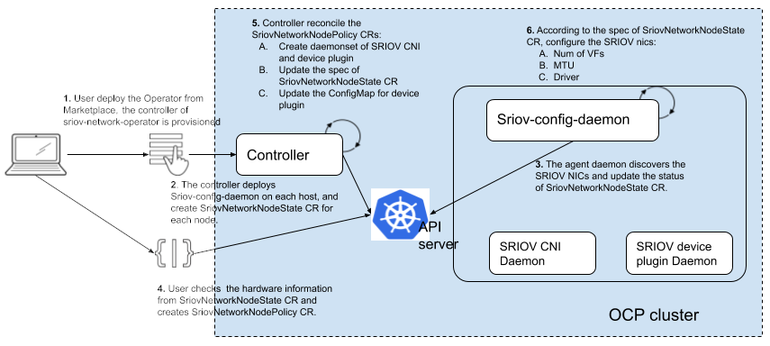

# sriov-network-operator

The Sriov Network Operator is designed to help the user to provision and configure SR-IOV CNI plugin and Device plugin in the Openshift cluster.

## Motivation

SR-IOV network is an optional feature of an Openshift cluster. To make it work, it requires different components to be provisioned and configured accordingly. It makes sense to have one operator to coordinate those relevant components in one place, instead of having them managed by different operators. And also, to hide the complexity, we should provide an elegant user interface to simplify the process of enabling SR-IOV.

## Features

- Initialize the supported SR-IOV NIC types on selected nodes.
- Provision/upgrade SR-IOV device plugin executable on selected node.  
- Provision/upgrade SR-IOV CNI plugin executable on selected nodes.
- Manage configuration of SR-IOV device plugin on host.
- Generate net-att-def CRs for SR-IOV CNI plugin
- Supports operation in a virtualized Kubernetes deployment
  - Discovers VFs attached to the Virtual Machine (VM)
  - Does not require attached of associated PFs
  - VFs can be associated to SriovNetworks by selecting the appropriate PciAddress as the RootDevice in the SriovNetworkNodePolicy

## Quick Start

For more detail on installing this operator, refer to the [quick-start](doc/quickstart.md) guide.

## API

The SR-IOV network operator introduces following new CRDs:

- SriovNetwork

- SriovNetworkNodeState

- SriovNetworkNodePolicy

### SriovNetwork

A custom resource of SriovNetwork could represent the a layer-2 broadcast domain where some SR-IOV devices are attach to. It is primarily used to generate a NetworkAttachmentDefinition CR with an SR-IOV CNI plugin configuration. 

This SriovNetwork CR also contains the ‘resourceName’ which is aligned with the ‘resourceName’ of SR-IOV device plugin. One SriovNetwork obj maps to one ‘resoureName’, but one ‘resourceName’ can be shared by different SriovNetwork CRs.

This CR should be managed by cluster admin. Here is an example:

```yaml
apiVersion: sriovnetwork.openshift.io/v1
kind: SriovNetwork
metadata:
  name: example-network
  namespace: example-namespace
spec:
  ipam: |
    {
      "type": "host-local",
      "subnet": "10.56.217.0/24",
      "rangeStart": "10.56.217.171",
      "rangeEnd": "10.56.217.181",
      "routes": [{
        "dst": "0.0.0.0/0"
      }],
      "gateway": "10.56.217.1"
    }
  vlan: 0
  resourceName: intelnics
```

#### Chaining CNI metaplugins

It is possible to add additional capabilities to the device configured via the SR-IOV configuring optional metaplugins.

In order to do this, the `metaPlugins` field must contain the array of one or more additional configurations used to build a [network configuration list](https://github.com/containernetworking/cni/blob/master/SPEC.md#network-configuration-lists), as per the following example:

```yaml
apiVersion: sriovnetwork.openshift.io/v1
kind: SriovNetwork
metadata:
  name: example-network
  namespace: example-namespace
spec:
  ipam: |
    {
      "type": "host-local",
      "subnet": "10.56.217.0/24",
      "rangeStart": "10.56.217.171",
      "rangeEnd": "10.56.217.181",
      "routes": [{
        "dst": "0.0.0.0/0"
      }],
      "gateway": "10.56.217.1"
    }
  vlan: 0
  resourceName: intelnics
  metaPlugins : |
    {
      "type": "tuning",
      "sysctl": {
        "net.core.somaxconn": "500"
      }
    },
    {
      "type": "vrf",
      "vrfname": "red"
    }
```

### SriovNetworkNodeState

The custom resource to represent the SR-IOV interface states of each host, which should only be managed by the operator itself.

- The ‘spec’ of this CR represents the desired configuration which should be applied to the interfaces and SR-IOV device plugin.
- The ‘status’ contains current states of those PFs (baremetal only), and the states of the VFs. It helps user to discover SR-IOV network hardware on node, or attached VFs in the case of a virtual deployment.

The spec is rendered by sriov-policy-controller, and consumed by sriov-config-daemon. Sriov-config-daemon is responsible for updating the ‘status’ field to reflect the latest status, this information can be used as input to create SriovNetworkNodePolicy CR.

An example of SriovNetworkNodeState CR:

```yaml
apiVersion: sriovnetwork.openshift.io/v1
kind: SriovNetworkNodeState
metadata:
  name: worker-node-1
  namespace: sriov-network-operator
spec:
  interfaces:
  - deviceType: vfio-pci
    mtu: 1500
    numVfs: 4
    pciAddress: 0000:86:00.0
status:
  interfaces:
  - deviceID: "1583"
    driver: i40e
    mtu: 1500
    numVfs: 4
    pciAddress: 0000:86:00.0
    maxVfs: 64
    vendor: "8086"
    Vfs:
      - deviceID: 154c
      driver: vfio-pci
      pciAddress: 0000:86:02.0
      vendor: "8086"
      - deviceID: 154c
      driver: vfio-pci
      pciAddress: 0000:86:02.1
      vendor: "8086"
      - deviceID: 154c
      driver: vfio-pci
      pciAddress: 0000:86:02.2
      vendor: "8086"
      - deviceID: 154c
      driver: vfio-pci
      pciAddress: 0000:86:02.3
      vendor: "8086"
  - deviceID: "1583"
    driver: i40e
    mtu: 1500
    pciAddress: 0000:86:00.1
    maxVfs: 64
    vendor: "8086"
```

From this example, in status field, the user can find out there are 2 SRIOV capable NICs on node 'work-node-1'; in spec field, user can learn what the expected configure is generated from the combination of SriovNetworkNodePolicy CRs.  In the virtual deployment case, a single VF will be associated with each device.

### SriovNetworkNodePolicy

This CRD is the key of SR-IOV network operator. This custom resource should be managed by cluster admin, to instruct the operator to:

1. Render the spec of SriovNetworkNodeState CR for selected node, to configure the SR-IOV interfaces.  In virtual deployment, the VF interface is read-only.
2. Deploy SR-IOV CNI plugin and device plugin on selected node.
3. Generate the configuration of SR-IOV device plugin.

An example of SriovNetworkNodePolicy CR:

```yaml
apiVersion: sriovnetwork.openshift.io/v1
kind: SriovNetworkNodePolicy
metadata:
  name: policy-1
  namespace: sriov-network-operator
spec:
  deviceType: vfio-pci
  mtu: 1500
  nicSelector:
    deviceID: "1583"
    rootDevices:
    - 0000:86:00.0
    vendor: "8086"
  nodeSelector:
    feature.node.kubernetes.io/network-sriov.capable: "true"
  numVfs: 4
  priority: 90
  resourceName: intelnics
```

In this example, user selected the nic from vendor '8086' which is intel, device module is '1583' which is XL710 for 40GbE, on nodes labeled with 'network-sriov.capable' equals 'true'. Then for those PFs, create 4 VFs each, set mtu to 1500 and the load the vfio-pci driver to those virtual functions.  

In a virtual deployment: 
- The mtu of the PF is set by the underlying virtualization platform and cannot be changed by the sriov-network-operator.
- The numVfs parameter has no effect as there is always 1 VF
- The deviceType field depends upon whether the underlying device/driver is [native-bifurcating or non-bifurcating](https://doc.dpdk.org/guides/howto/flow_bifurcation.html) For example, the supported Mellanox devices support native-bifurcating drivers and therefore deviceType should be netdevice (default).  The support Intel devices are non-bifurcating and should be set to vfio-pci.

#### Multiple policies

When multiple SriovNetworkNodeConfigPolicy CRs are present, the `priority` field
(0 is the highest priority) is used to resolve any conflicts. Conflicts occur
only when same PF is referenced by multiple policies. The final desired
configuration is saved in `SriovNetworkNodeState.spec.interfaces`.

Policies processing order is based on priority (lowest first), followed by `name`
field (starting from `a`). Policies with same **priority** or **non-overlapping
VF groups** (when #-notation is used in pfName field) are merged, otherwise only
the highest priority policy is applied. In case of same-priority policies and
overlapping VF groups, only the last processed policy is applied.

#### Externally Manage virtual functions

When `ExternallyManage` is request on a policy the operator will only skip the virtual function creation.
The operator will only bind the virtual functions to the requested driver and expose them via the device plugin.
Another difference when this field is requested in the policy is that when this policy is removed the operator
will not remove the virtual functions from the policy.

*Note:* This means the user must create the virtual functions before they apply the policy or the webhook will reject
the policy creation.

It's possible to use something like nmstate kubernetes-nmstate or just a simple systemd file to create
the virtual functions on boot.

This feature was created to support deployments where the user want to use some of the virtual funtions for the host
communication like storage network or out of band managment and the virtual functions must exist on boot and not only
after the operator and config-daemon are running.

#### Disabling SR-IOV Config Daemon plugins

It is possible to disable SR-IOV network operator config daemon plugins in case their operation
is not needed or un-desirable.

As an example, some plugins perform vendor specific firmware configuration
to enable SR-IOV (e.g `mellanox` plugin). certain deployment environments may prefer to perform such configuration
once during node provisioning, while ensuring the configuration will be compatible with any sriov network node policy
defined for the particular environment. This will reduce or completely eliminate the need for reboot of nodes during SR-IOV
configurations by the operator.

This can be done by setting SriovOperatorConfig `default` CR `spec.disablePlugins` with the list of desired plugins
to disable.

**Example**:

```yaml
apiVersion: sriovnetwork.openshift.io/v1
kind: SriovOperatorConfig
metadata:
  name: default
  namespace: sriov-network-operator
spec:
  ...
  disablePlugins:
    - mellanox
  ...
```

> **NOTE**: Currently only `mellanox` plugin can be disabled.

### Parallel draining

It is possible to drain more than one node at a time using this operator.

The configuration is done via the SriovNetworkNodePool, selecting a number of nodes using the node selector and how many
nodes in parallel from the pool the operator can drain in parallel. maxUnavailable can be a number or a percentage.

> **NOTE**: every node can only be part of one pool, if a node is selected by more than one pool, then it will not be drained

> **NOTE**: If a node is not part of any pool it will have a default configuration of maxUnavailable 1

**Example**:

```yaml
apiVersion: sriovnetwork.openshift.io/v1
kind: SriovNetworkPoolConfig
metadata:
  name: worker
  namespace: sriov-network-operator
spec:
  maxUnavailable: 2
  nodeSelector:
    matchLabels:
      node-role.kubernetes.io/worker: ""
```

### Resource Injector Policy

By default, the Resource injector webhook has a failed policy of ignored, this was implemented to not block pod creation
in case the webhook is not available.

with a feature introduced in Kubernetes 1.28(Beta) called [MatchConditions](https://kubernetes.io/docs/reference/access-authn-authz/extensible-admission-controllers/#matching-requests-matchconditions)
we can move the webhook failed policy to be Fail. In this case the operator configured the Mutating webhook for the resource
injector only on pods with the secondary network annotation of `k8s.v1.cni.cncf.io/networks`.
It's possible to enable the feature with a FeatureGate via the SriovOperatorConfig object

> **NOTE**: the feature is disabled by default

**Example**:

```yaml
apiVersion: sriovnetwork.openshift.io/v1
kind: SriovOperatorConfig
metadata:
  name: default
  namespace: sriov-network-operator
spec:
  ...
  featureGates:
    resourceInjectorMatchCondition: true
  ...
```

## Components and design

This operator is split into 2 components:

- controller
- sriov-config-daemon

The controller is responsible for:

1. Read the SriovNetworkNodePolicy CRs and SriovNetwork CRs as input.
2. Render the manifests for SR-IOV CNI plugin and device plugin daemons.
3. Render the spec of SriovNetworkNodeState CR for each node.

The sriov-config-daemon is responsible for:

1. Discover the SRIOV NICs on each node, then sync the status of SriovNetworkNodeState CR.
2. Take the spec of SriovNetworkNodeState CR as input to configure those NICs.

## Workflow


