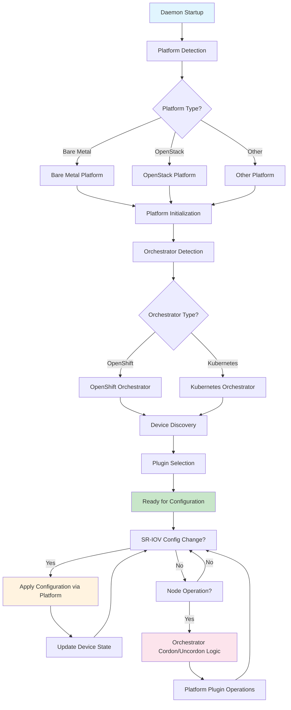

# Platform and Orchestrator Abstraction

## Summary

This design document describes the introduction of platform and orchestrator abstraction layers in the SR-IOV Network Operator. These abstractions separate platform-specific (infrastructure provider) logic from orchestrator-specific (Kubernetes distribution) logic, making it easier to add support for new infrastructure platforms and Kubernetes distributions.

## Motivation

The SR-IOV Network Operator has historically been tightly coupled to specific infrastructure platforms and Kubernetes distributions, particularly OpenShift. As the operator expanded to support different virtualization platforms like OpenStack, AWS and various Kubernetes distributions, the need for a clean abstraction layer became apparent.

### Use Cases

1. **Multi-Platform Support**: Enable the operator to run efficiently on different infrastructure platforms (bare metal, OpenStack, AWS, Oracle, etc.) with platform-specific optimizations
2. **Multi-Orchestrator Support**: Support different Kubernetes distributions (vanilla Kubernetes, OpenShift, etc.) with orchestrator-specific behaviors

### Goals

* Create a clean abstraction layer that separates platform-specific logic from orchestrator-specific logic
* Re-implement existing support for bare metal and OpenStack platforms using the new abstraction layer
* Re-implement existing support for Kubernetes and OpenShift orchestrators using the new abstraction layer
* Provide a plugin architecture that makes it easy to add new platforms and orchestrators
* Maintain backward compatibility with existing functionality
* Enable better testability through interface-based design

### Non-Goals

* Support all possible infrastructure platforms in the initial implementation
* Change existing SR-IOV CRD API structures or user-facing configuration interfaces

## Proposal

### Workflow Description

1. **Daemon Startup**: The SR-IOV daemon detects the platform type by examining the node's provider ID and environment variables
2. **Platform Initialization**: The appropriate platform implementation is instantiated using the factory pattern and initialized
3. **Orchestrator Detection**: The orchestrator type is detected based on cluster APIs and characteristics
4. **Device Discovery**: The platform interface discovers available SR-IOV devices using platform-specific methods
5. **Plugin Selection**: The platform selects appropriate vendor plugins based on discovered devices and platform constraints
6. **Configuration Application**: When SR-IOV configurations change, the daemon uses the platform interface to apply changes through the selected plugins
7. **Node Management**: During node operations, the orchestrator interface handles any distribution-specific logic like cordon/uncordon coordination

*NOTE:* The platform is detected at startup based on node metadata and environment variables, while the orchestrator is detected based on cluster characteristics and available APIs.



### API Extensions

#### Platform Interface

```golang
type Interface interface {
    // Init initializes the platform-specific configuration.
    // This is called once during daemon startup after the platform is created.
    // Returns an error if initialization fails.
    Init() error

    // Name returns the name of the platform implementation (e.g., "Baremetal", "OpenStack").
    // This is used for logging and identification purposes.
    Name() string

    // DiscoverSriovDevices discovers all SR-IOV capable devices on the host.
    // This is called during status updates to get the current state of SR-IOV devices.
    // Returns a list of discovered interfaces with their SR-IOV capabilities, or an error if discovery fails.
    DiscoverSriovDevices() ([]sriovnetworkv1.InterfaceExt, error)

    // DiscoverBridges discovers software bridges managed by the operator.
    // This is called during status updates when vars.ManageSoftwareBridges is enabled.
    // Returns a list of discovered bridges, or an error if discovery fails.
    // If the platform does not support bridge discovery, it should return an empty list and error of type ErrOperationNotSupportedByPlatform.
    DiscoverBridges() (sriovnetworkv1.Bridges, error)

    // GetVendorPlugins returns the plugins to use for this platform.
    // The first return value is the main plugin that will be applied last (e.g., generic plugin).
    // The second return value is a list of additional plugins to run (e.g., vendor-specific plugins).
    // This is called during daemon initialization to load the appropriate plugins for the platform.
    // Returns the main plugin, additional plugins, and an error if plugin loading fails.
    GetVendorPlugins(ns *sriovnetworkv1.SriovNetworkNodeState) (plugin.VendorPlugin, []plugin.VendorPlugin, error)

    // SystemdGetVendorPlugin returns the appropriate plugin for the given systemd configuration phase.
    // This is used when the daemon runs in systemd mode.
    // phase can be consts.PhasePre (before reboot) or consts.PhasePost (after reboot).
    // Returns the plugin to use for the specified phase, or an error if the phase is invalid.
    SystemdGetVendorPlugin(phase string) (plugin.VendorPlugin, error)
}
```

#### Orchestrator Interface

```golang
type Interface interface {
    // Name returns the name of the orchestrator implementation (e.g., "Kubernetes", "OpenShift").
    // This is used for logging and identification purposes.
    Name() string

    // ClusterType returns the type of cluster orchestrator (OpenShift or Kubernetes).
    // This is used to determine cluster-specific behavior throughout the operator.
    ClusterType() consts.ClusterType

    // Flavor returns the specific flavor of the cluster orchestrator.
    // Most implementations return ClusterFlavorDefault for standard clusters.
    // For OpenShift, this can be ClusterFlavorDefault (standard) or ClusterFlavorHypershift.
    // If the implementation does not have a specific flavor, ClusterFlavorDefault should be returned.
    Flavor() consts.ClusterFlavor

    // BeforeDrainNode performs orchestrator-specific logic before draining a node.
    // This is called by the drain controller before starting the node drain process.
    // For OpenShift, this may pause the MachineConfigPool to prevent automatic reboots.
    // Returns:
    //   - bool: true if the drain can proceed, false if the orchestrator needs more time to prepare
    //   - error: an error if the preparation failed
    BeforeDrainNode(context.Context, *corev1.Node) (bool, error)

    // AfterCompleteDrainNode performs orchestrator-specific logic after node draining is completed.
    // This is called by the drain controller after the node has been successfully drained and uncordoned.
    // For OpenShift, this may unpause the MachineConfigPool if this was the last node being drained.
    // Returns:
    //   - bool: true if the post-drain operations completed successfully, false if more time is needed
    //   - error: an error if the post-drain operations failed
    AfterCompleteDrainNode(context.Context, *corev1.Node) (bool, error)
}
```

### Implementation Details/Notes/Constraints

#### Platform Implementations

1. **Bare Metal Platform (`pkg/platform/baremetal/`)**:
   - Uses standard SR-IOV device discovery via PCI scanning
   - Supports vendor-specific plugins (Intel, Mellanox/NVIDIA)
   - Handles bridge discovery and management
   - Supports both daemon and systemd configuration modes
   - Discovers actual physical SR-IOV devices with PF/VF relationships

2. **OpenStack Platform (`pkg/platform/openstack/`)**:
   - Uses virtual device discovery based on OpenStack metadata
   - Reads device information from config-drive or metadata service (`http://169.254.169.254/openstack/latest/`)
   - Uses virtual plugin for VF configuration
   - Does not support systemd mode or bridge management
   - Treats each VF as a standalone device with a single VF entry

3. **AWS Platform (`pkg/platform/aws/`)** ([PR #899](https://github.com/k8snetworkplumbingwg/sriov-network-operator/pull/899)):
   - Uses virtual device discovery based on AWS EC2 metadata service
   - Reads MAC addresses and subnet information from metadata service (`http://169.254.169.254/latest/meta-data/`)
   - Uses virtual plugin for VF configuration
   - Does not support systemd mode or bridge management
   - Treats each Elastic Network Adapter VF as a standalone device
   - Sets NetFilter field with AWS subnet ID for network isolation (format: `aws/NetworkID:<subnet-id>`)

#### Orchestrator Implementations

1. **Kubernetes Orchestrator (`pkg/orchestrator/kubernetes/`)**:
   - Simple implementation with minimal cluster-specific logic
   - No special drain/uncordon handling (returns true for all drain operations)
   - Always returns ClusterFlavorDefault
   - Suitable for vanilla Kubernetes clusters

2. **OpenShift Orchestrator (`pkg/orchestrator/openshift/`)**:
   - Complex drain handling with Machine Config Pool (MCP) management
   - Supports both regular OpenShift (ClusterFlavorDefault) and Hypershift (ClusterFlavorHypershift) flavors
   - Flavor detected by examining the Infrastructure resource (controlPlaneTopology field)
   - Manages MCP pausing during node drain operations to prevent automatic node reboots
   - Uses mutex to safely coordinate MCP pause/unpause operations across multiple nodes

#### Platform Detection

Platform detection occurs in the daemon startup code based on the node's provider ID. The daemon examines the `Spec.ProviderID` field of the node object and matches it against known platform identifiers.

The platform mapping is defined in `pkg/vars/vars.go`:

```golang
// PlatformsMap contains supported platforms for virtual VF
PlatformsMap = map[string]consts.PlatformTypes{
    "openstack": consts.VirtualOpenStack,
    "aws": consts.AWS,  // Added in PR #899
}
```

Detection logic:
```golang
// Platform detection logic
for key, pType := range vars.PlatformsMap {
    if strings.Contains(strings.ToLower(nodeInfo.Spec.ProviderID), strings.ToLower(key)) {
        vars.PlatformType = pType
    }
}
```

Examples of provider IDs:
- AWS: `aws:///us-east-1a/i-0123456789abcdef0`
- OpenStack: `openstack:///instance-uuid`
- Bare Metal: No provider ID or unmatched provider ID (defaults to `consts.Baremetal`)

#### Factory Pattern

Both platform and orchestrator use factory patterns for instantiation, facilitating easy extensions for new implementations:

```golang
// Platform factory (pkg/platform/platform.go)
func New(platformType consts.PlatformTypes, hostHelpers helper.HostHelpersInterface) (Interface, error) {
    switch platformType {
    case consts.Baremetal:
        return baremetal.New(hostHelpers)
    case consts.VirtualOpenStack:
        return openstack.New(hostHelpers)
    case consts.AWS:
        return aws.New(hostHelpers)  // Added in PR #899
    default:
        return nil, fmt.Errorf("unknown platform type %s", platformType)
    }
}

// Orchestrator factory (pkg/orchestrator/orchestrator.go)
func New(clusterType consts.ClusterType) (Interface, error) {
    switch clusterType {
    case consts.ClusterTypeOpenshift:
        return openshift.New()
    case consts.ClusterTypeKubernetes:
        return kubernetes.New()
    default:
        return nil, fmt.Errorf("unknown cluster type: %s", clusterType)
    }
}
```

### Upgrade & Downgrade considerations

Existing configurations and behaviors are preserved, with the abstraction layer providing the same functionality through the new interface structure.

No user-facing API changes are required, and existing SR-IOV configurations will continue to work without modification.

## Benefits for Adding New Platforms

### 1. Clear Separation of Concerns

The abstraction separates infrastructure-specific logic (platform) from Kubernetes distribution-specific logic (orchestrator), making it easier to reason about and implement support for new platforms.

### 2. Standardized Interface

New platforms only need to implement the well-defined `Platform Interface`, which includes:
- Device discovery methods
- Plugin selection logic
- Platform-specific initialization

### 3. Minimal Core Changes

Adding a new platform requires:
1. Creating a new package under `pkg/platform/<platform-name>/`
2. Implementing the `Platform Interface`
3. Adding the platform to the factory function
4. Adding platform detection logic

No changes to core operator logic, existing platforms, or user-facing APIs are required.

### 4. Plugin Architecture

The platform interface includes plugin selection methods, allowing each platform to:
- Choose appropriate vendor plugins
- Use platform-specific plugins (like the virtual plugin for OpenStack)
- Support different configuration modes (daemon vs systemd)

### 5. Independent Development and Testing

Each platform implementation is self-contained, enabling:
- Independent development of platform support
- Platform-specific unit tests
- Mock-based testing of platform interactions
- Easier debugging and maintenance

### Example: Adding a New Platform

Adding support for a new platform follows a standardized process demonstrated by the AWS implementation:

1. **Create Platform Package**: Create a new package under `pkg/platform/<platform-name>/` that implements the Platform Interface
   - Example: `pkg/platform/aws/aws.go`

2. **Platform Detection**: Add platform detection logic to `pkg/vars/vars.go` PlatformsMap
   - Example: `"aws": consts.AWS`

3. **Factory Registration**: Register the new platform in `pkg/platform/platform.go` factory function
   - Example: Add case statement for `consts.AWS`

4. **Implement Platform Interface**:
   - `Init()`: Load device info from metadata service or checkpoint
   - `Name()`: Return platform name
   - `DiscoverSriovDevices()`: Implement platform-specific device discovery
   - `DiscoverBridges()`: Return error if not supported
   - `GetVendorPlugins()`: Return appropriate plugins (typically virtual plugin for cloud)
   - `SystemdGetVendorPlugin()`: Return error if not supported

5. **Add Platform Constants**: Update `pkg/consts/platforms.go` with new platform type
   - Example: `AWS PlatformTypes = "AWS"`

6. **Testing**: Add comprehensive unit tests including:
   - Initialization tests (with and without checkpoint)
   - Device discovery tests
   - Metadata service interaction tests (using mocks)
   - Error handling tests
   - Plugin selection tests

7. **Helper Extensions**: Add any needed helper functions for platform-specific operations
   - Example: `DiscoverSriovVirtualDevices()` for virtual VF discovery

This standardized approach ensures that new platforms integrate seamlessly with the existing operator architecture without requiring changes to core logic or other platform implementations.

## Implementation Status

### Merged (PR #902)

The base platform and orchestrator abstraction has been implemented and merged:

- ✅ Platform Interface definition (`pkg/platform/platform.go`)
- ✅ Orchestrator Interface definition (`pkg/orchestrator/orchestrator.go`)
- ✅ Bare Metal Platform implementation (`pkg/platform/baremetal/`)
- ✅ OpenStack Platform implementation (`pkg/platform/openstack/`)
- ✅ Kubernetes Orchestrator implementation (`pkg/orchestrator/kubernetes/`)
- ✅ OpenShift Orchestrator implementation (`pkg/orchestrator/openshift/`)
- ✅ Factory patterns for both abstractions
- ✅ Platform detection logic
- ✅ Comprehensive unit tests
- ✅ Mock interfaces for testing
- ✅ Integration with daemon and operator controllers
