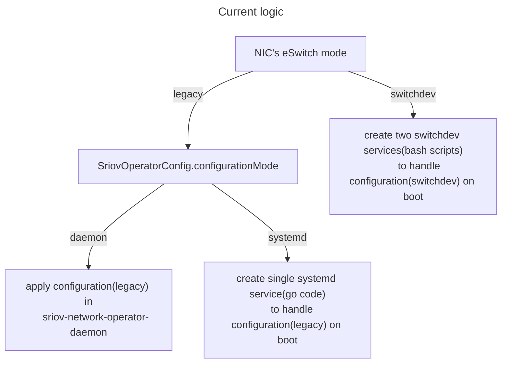
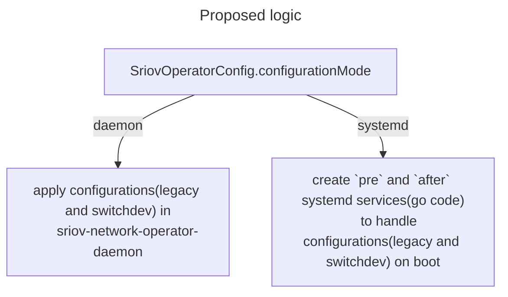

# switchdev and systemd modes refactoring

## Summary

We need to refactor the implementation used for NICs in switchdev mode and align its behavior with the systemd
mode of the operator. The refactoring is required to simplify the development of the new switchdev-related
features for the sriov-network-operator.

## Motivation

Currently the **sriov-network-operator** supports two configuration modes:
* `daemon`
* `systemd`

The configuration mode can be changed by setting the `configurationMode` field in the `SriovOperatorConfig` CR.

_**Note**: This setting is global and applies to all sriov-network-operator-daemons in the cluster._

In the `daemon` mode, which historically is the first implemented mode,
the operator will setup NICs with _**SRIOV legacy**_ configuration directly in the **sriov-network-operator-daemon**
component by executing all enabled plugins.

When the operator is in `systemd` mode, the **sriov-network-operator-daemon** component will execute most plugins
in the same way as in the `daemon` mode but will skip the call of the *generic* or *virtual*
plugin(when running in a virtualized environment) and instead will render config for the systemd
service that starts on the next OS boot and calls one of these plugins.
Then, the result of the service execution is handled by the **sriov-network-operator-daemon**.

The `systemd` mode was implemented to support scenarios when, after the host reboot,
we need VFs to be configured before Kubernetes (kubelet) and Pods with workloads are started.

To setup NICs with _**switchdev**_ configuration, the operator uses a different flow that ignores
the `configurationMode` setting. Two systemd services(not the same as used for systemd mode) are created on the node.
The first service is executed before the NetworkManager starts, and the second one after.
Both services run bash scripts. The script from the first service is responsible for VFs creation and for
switching a NIC to the switchdev eSwitch mode. The script from the second service binds VFs to the required drivers.

If a NIC has _**switchdev**_ configuration, then `configurationMode` of the operator does not affect it.



#### Problems of the current implementation

* it is confusing that `configurationMode` does not affect devices with switchdev configuration.
* system services for switchdev configuration are shell scripts completely independent from the
main code base and it is hard to extend them with new functionality.
* for switchdev NICs,  VF configuration flow (bash-based) has some limitations compared to legacy VF configuration.
* it is impossible to apply switchdev configuration for the NIC without reboot.

### Use Cases

* As a developer I don't want to maintain the code with similar logic in two places:
switchdev bash scrips and **sriov-network-operator-daemon** code.
* As a developer and a user I want to have only one set of systemd services that handle
both _**switchdev**_  configurations and `systemd` mode.
* As a user I want `configurationMode` to work the same way for NICs with
_**legacy**_ and _**switchdev**_ configurations.
* As a user I want to apply _**switchdev**_ configuration for NIC by the **sriov-network-operator-daemon**
without reboot (in case if reboot is not required by other logic,
e.g. kernel parameters configuration, FW configuration).

### Goals

* it should be possible to apply  _**switchdev**_ configuration in the **sriov-network-operator-daemon** without reboot.
* the code used by `daemon` and `systemd` modes to handle _**switchdev**_ and _**legacy**_
configurations should be the same Golang code.
* `configurationMode` option should work the same for NICs with _**legacy**_ and _**switchdev**_ configurations.
* the operator should use unified systemd services which will be deployed only
if the operator works in the `systemd` mode.
* `systemd` mode should be changed to support 2 stage configuration: 
pre system network manager (NetworkManager or netplan) and after system network manager.
  _Note: This is required to support all use-cases supported by the current switchdev implementation._


### Non-Goals

* replace _Externally Manage PF_ feature
* remove all shell scripts from the code

## Proposal

1. Drop existing bash-based implementation which is used for NICs with _**switchdev**_ configuration
2. Modify _generic_ and _virtual (if required)_ plugins to support _**switchdev**_ configuration
3. Modify code related to the _Externally Manage PF_ feature 
to support _**switchdev**_ configuration
4. Modify `systemd` mode flow to handle devices with both  _**legacy**_  and _**switchdev**_  configurations
5. Split `systemd` mode system service to two parts:
    - `pre` - executes before NetworkManager/netplan and OVS
    - `after` - executes after NetworkManager/netplan and OVS




### Workflow Description

Users using only NICs with _**legacy**_ SRIOV configurations will not need to change their workflow.
The operator should behave for these configurations the same way as it does now.

Users using NICs with _**switchdev**_ configurations will need to explicitly set operator's 
`configurationMode` to `systemd` if they expect the configuration of the NIC to happen
early on boot (before Kubernetes starts) to support the hwoffload use-case.

### API Extensions

#### SriovNetworkNodeState CR

`SriovNetworkNodeState.status.interfaces[*].Vfs[*].vdpaType` field should be added.

This field should be used to report information about type of the VDPA 
device that is configured for VF.
Empty string means that there is no VDPA device. 

Valid values are: `virtio`, `vhost` (same as in `SriovNetworkNodePolicySpec`)

```
type VirtualFunction struct {
	Name       string `json:"name,omitempty"`
	Mac        string `json:"mac,omitempty"`
	Assigned   string `json:"assigned,omitempty"`
	Driver     string `json:"driver,omitempty"`
	PciAddress string `json:"pciAddress"`
	Vendor     string `json:"vendor,omitempty"`
	DeviceID   string `json:"deviceID,omitempty"`
	Vlan       int    `json:"Vlan,omitempty"`
	Mtu        int    `json:"mtu,omitempty"`
	VfID       int    `json:"vfID"`
+ 	VdpaType   string `json:"vdpaType,omitempty"`
}
```

#### SriovOperatorConfig CR

Change in the operator's behavior: `configurationMode` option now have effect
on NICs with _**switchdev**_ configurations.

### Implementation Details/Notes/Constraints

We should consider improving unit-test coverage for modified code parts during the implementation.

After the operator upgrade, we should clean up from the host unneeded files (scripts, system services, config files) created by the previous version of the operator. 

### Upgrade & Downgrade considerations

* after upgrading the operator, _**switchdev**_ config will be applied by **sriov-network-operator-daemon** and not by systemd service unless the user changes `configurationMode` setting to `systemd`
* after upgrading the operator, "implicit mixed mode" when _**switchdev**_ NIC configurations are handled by bash scripts(in systemd services)
and _**legacy**_ NIC configurations are managed by **sriov-network-operator-daemon** will not be supported anymore.

_Note: `configurationMode` is a global setting, so the user will need to decide 
which mode to use for the entire cluster_

Upgrade/Downgrade for users using only NICs with _**legacy**_  configurations will not require any actions.
Upgrade/Downgrade for clusters with _**switchdev**_ configurations will require
changing the operator's `configurationMode` option.

### Test Plan

The proposed changes will not introduce new functionality.

After the refactoring, _**switchdev**_ configurations will also be supported in the `daemon` mode.
This is the only thing we may need to develop additional tests for.
All other changes should be validated by running regression testing.

_Note: behavior for _**switchdev**_ configurations will be changed in a non-fully compatible way;
this may require to fix existing tests._
